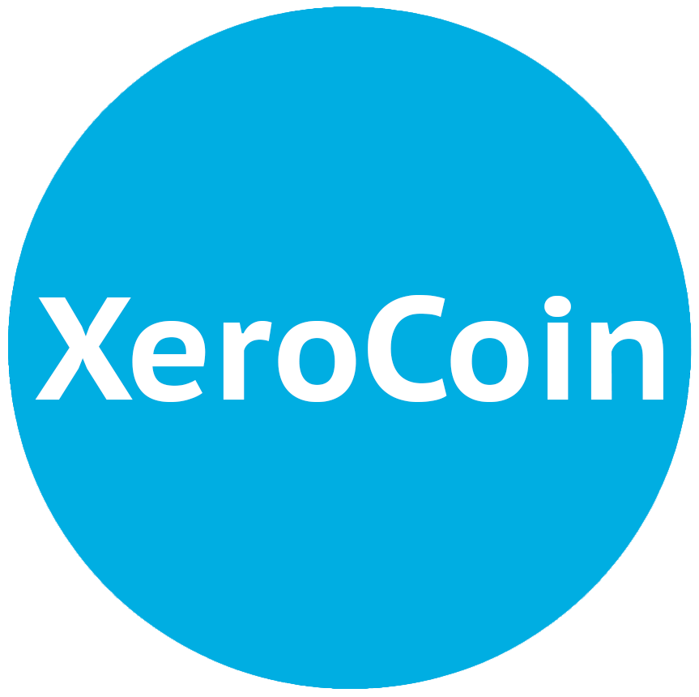

XeroCoin Core (XRO)
==================

  

XeroCoin Core is the reference implementation for the XeroCoin network (XRO) — a lightweight, SHA-256 Proof-of-Work blockchain built for secure, transparent transactions and straightforward infrastructure integration.

- Website: https://temp-website.xerocoinexplorer.com/
- Explorer: https://xerocoinexplorer.com/
- GitHub: https://github.com/XeroCoinX/Xero
- Discord: https://discord.gg/qDbBFh92ZT

What is XeroCoin?
-----------------
XeroCoin is a decentralized, open-source cryptocurrency designed for efficient digital transactions with predictable tokenomics and a clean integration path for services like wallets, pools, explorers, and exchanges.

XeroCoin Core includes:
- Full node (validates blocks + transactions)
- Wallet
- Optional graphical user interface (Qt)

Quick Facts
-----------
- 10-minute blocks
- 5000-block halving interval
- 20-block coinbase maturity
- 6 recommended confirmations

Network Parameters
------------------
- Total Supply: 100,000 XRO (max)
- Initial Block Reward: 10 XRO
- Halving Interval: 5000 blocks
- Mining Algorithm: SHA-256
- Target Block Time: 10 minutes
- Difficulty Adjustment: BCH-style ASERT (per-block) after activation, legacy retarget before activation
- Coinbase Maturity: 20 blocks
- Recommended Confirmations: 6 blocks
- Address Format: Bech32 (xro...)

ASERT Hardfork (Mainnet)
------------------------
- Activation Height: 4920
- Algorithm: BCH-style ASERT (aserti3-2d)
- Adjustment Frequency: every block (DA per block) after activation
- Target Spacing: 600 seconds
- Half-Life: 2 days (172800 seconds)
- ASERT Start Difficulty: `nBits = 0x1a44b82f` ("1G" bootstrap target)
- Pre-activation behavior: legacy interval retarget logic remains unchanged

Ports (Default)
---------------
- P2P Port: 25170
- RPC Port: 25169

Documentation
-------------
More documentation is available in:
- `doc/` (developer/build notes)
- `test/` (functional tests)
- `src/test/` (unit tests)

Build & Test
------------
Typical flow:
- `./autogen.sh`
- `./configure --with-incompatible-bdb`
- `make -j$(nproc)`
- `make check` (optional, runs unit tests)

Short Build Guide (Ubuntu/Debian)
----------------------------------
1. Install dependencies:
  - `sudo apt update`
  - `sudo apt install -y build-essential libtool autotools-dev automake pkg-config bsdmainutils python3 libevent-dev libboost-dev libsqlite3-dev libminiupnpc-dev libzmq3-dev`

2. Build from source:
  - `git clone https://github.com/XeroCoinX/Xero.git`
  - `cd Xero`
  - `./autogen.sh`
  - `./configure --with-incompatible-bdb`
  - `make -j$(nproc)`

3. Verify binaries:
  - `./src/xerod --version`
  - `./src/xero-cli --version`

Useful targeted test run:
- `./src/test/test_xero --run_test=pow_tests --log_level=test_suite`

License
-------
XeroCoin Core is released under the terms of the MIT license. See [COPYING](COPYING).
